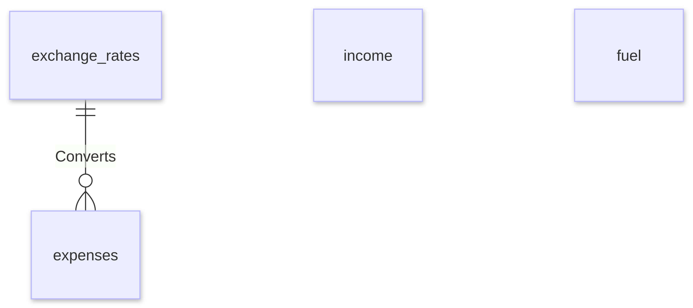

# Design document

By Susanne Dahlin
Video overview: https://vimeo.com/1155129308?share=copy&fl=sv&fe=ci

## Purpose

The purpose of this database is to store and track fuel consumption and travel expenses across various currencies during my motorcycle travels across South America during 2024, 2025 and 2026. Prior to this database, this data was stored in spreadsheets and it was hard to evaluate expenses across a specific perdiod of time or category. It was also hard to evaluate average fuel consumption over a period of time, and compare that to the overall average.

## Scope

The database includes all entities necessary to facilitate the process of keeping track of fuel consumption and costs across a variety of currencies.

The scope of the database includes:
* Expense information across various categories and currencies.
* Exchange rate information for each currency used.
* Income information to track current available funds.
* Fuel data to track and compare fuel consuption across time.

The scope does not include:
* Exchange rate flucutations over time.
* Comparisons between planned and actual expenses.

## Functional requirements

This database will support:
* Tracking expenses over time and converting them to AUD (home currency) for easy comparison across multiple currencies.
* Adding more data over time in a variety of currencies.
* Showing how much savings are left as expenses are higher than income, but cannot go higher than savings.
* Tracking fuel consumption for the purpose of tracking average fuel data over time.

## Entities

This is the schema:

### Exchange rates

The `exchange_rates` table includes:
* `id` which is an `INTEGER` and a `PRIMARY KEY` to make sure it auotgenerates when new data is added.
* `country` which is `TEXT` and simply the name of the country visited. This cannot be `NULL`.
* `currency` which is `TEXT` and a three letter abreviation of the currency used in that country. This cannot be `NULL`.
* `exchange_rate` which is a `REAL` and cannot be `NULL`. This rate is used to convert the currency to AUD (the currency which my savings are in) for easy tracking in various queries made to the database.

### Expenses

The `expenses` table includes:
* `id` which is an `INTEGER` and a `PRIMARY KEY` to make sure it auotgenerates when new data is added.
* `date` which is `TEXT` and represenents the date the expense was made. This cannot be `NULL`.
* `name` which is `TEXT` and is the name of the expense, for example 'Pharmacy'. This can be `NULL` if no name is suitable. Its purpose is to aid in remembering the purpose of the expense, not track it.
* `amount` which is a `REAL` and represents the amount paid in the local currency. This cannot be `NULL`.
* `currency` which is `TEXT` and a `FOREIGN KEY` referensing the exchange rate in the `exchange-rates` table to check that the currency has been added there prior to expenses being imported or added using that currency. This cannot be `NULL`.
* `category` which is `TEXT` and indicates which broader category the expense belongs to an its purpose is to be able to track expenses based on various types of expense categories. This cannot be `NULL`.

### Income

The `income` table incudes:
* `id` which is an `INTEGER` and a `PRIMARY KEY` to make sure it auotgenerates when new data is added.
* `date` which is `TEXT` and represenents the date the expense was made. This cannot be `NULL`.
* `category` which is `TEXT` and restricted to being one of three things: Savings, Interest or Income. No other types of categories are allowed. This cannot be `NULL`.
* `amount` which is a `REAL` indicates the amound in AUD and is used when totalling expenses and subtracting it against total income and savings, for the purpose of checking how much money is left to travel for.

### Fuel

The `fuel` table includes:
* `id` which is an `INTEGER` and a `PRIMARY KEY` to make sure it auotgenerates when new data is added.
* `date` which is `TEXT` and represenents the date the expense was made. This cannot be `NULL`.
* `liters` which is a `REAL` and shows how many liters of fuel was purchased. This is used to keep track of average liters used per 100km driven over time and cannot be `NULL`.
* `odometer` which is an `INTEGER` and shows what the odomoter was saying at the time of purchase. This is used to keep track of average liters used per 100km driven over time and cannot be `NULL`.

## Relationships

As detailed by the diagram, there is only one core relationship and two independend entities. This is a very simple design that I chose for the purpose of avoiding unnessecary complexity in my database.

As detailed by the diagram:
* An exchange rate from the `exchange_rates` table can be added ones and used to continously convert many expenses in that currency added to the `expenses` table.
* The `income` table sits separatly. This table includes intial savings, as well as money accrued over time and is mainly used to keep track of how much money I have left to travel for.
* The `fuel` table sits separatly as its purpose is to keep track of how many liters of fuel is used. This helpfull as increased fuel consumption over a period of time can indicate issues with the vehicle or poor fuel quality.

## Optimisations

Per the typcial queries in `queries.sql` and the views in `schema.sql` the most common quereis involve expenses per category and by date. The currency column is also frequently used in these queries as it is the currency data that links to `exchange_rate` table to convert the amounts from the local currecy to AUD. Therefore two indexes have been created on the `expenses` table: One that collects `category` and `currenc`, and one that collects `date` and `currency`.

## Limitations

This database has a series of limitations:
* Exchange rates can flutuate over time, but this database can only handle one exchange rate per currency.
* As you do not have access to upload new expenses and fuel data into the database on the fly, you must save it somwhere else, then upload it as a .csv when you have access to the database.
* Mulitple currencies can be used on the same day, which means that if you query average expenses per currency and date, the database can use the same date for mulitple currencies.

